# 5 Implementierung

Kapitel 5 beschreibt die konkrete Umsetzung der in Kapitel 4 entworfenen Architektur. Für jede aktive Analyse-Stage wird die Implementierung mit Eingabe, Verarbeitungslogik, eingesetzten Werkzeugen und Ausgabe im `PipelineContext` erläutert. Code-Ausschnitte illustrieren zentrale Algorithmen und Designentscheidungen. Abschnitt 5.4 behandelt die forensische Integrität der Analysephase, Abschnitt 5.5 die Timesketch-Integration und Abschnitt 5.6 das Deployment via Docker.

---

## 5.1 Überlegungen zur Implementierung

Die Pipeline wurde iterativ entwickelt: Stage für Stage wurde implementiert, gegen ein reales Debian-Test-Image (5,7 GB, CyberDefenders) geprüft und erst dann in die Gesamtsequenz eingebettet. Dieses Vorgehen war durch die einheitliche `run(ctx: PipelineContext) -> PipelineContext`-Schnittstelle möglich — jede Stage kann vollständig isoliert aufgerufen werden, ohne dass die übrigen Stages laufen müssen.

Python 3.11 wurde als Implementierungssprache gewählt, da es zum Entwicklungszeitpunkt die aktuellste stabile Major-Version darstellte und alle benötigten Bibliotheken (Volatility3, yara-python, DuckDB, reportlab) offiziell unterstützte. Die virtuelle Umgebung (`python3 -m venv .venv`) isoliert die Projektabhängigkeiten von der Systeminstallation.

Bewusst verzichtet wurde auf ein Unit-Test-Framework und eine CI/CD-Pipeline. Stattdessen diente das Debian-Test-Image als Integrationstest: Läuft die Pipeline durch das Image durch und liefert den erwarteten Report, gilt eine Stage als funktionsfähig. Dieser pragmatische Ansatz war angesichts des zeitlichen Rahmens einer Bachelorarbeit vertretbar; für einen produktiven Einsatz wäre ein formales Test-Framework erforderlich.

Graceful Degradation ist das zentrale Implementierungsprinzip: Jede Stage ist in `pipeline.py` von einem `try/except`-Block umgeben (Funktion `run_stage()`). Ein Fehler in Stage 02 verhindert nicht das Log-Parsing in Stage 06. Dieses Verhalten entspricht dem forensischen Grundsatz, dass ein partielles Ergebnis einem fehlenden Ergebnis vorzuziehen ist. Stage 13 bewertet am Ende, wie viele Fehler aufgetreten sind und welche Gesamtqualität der Durchlauf erreicht hat.

---

## 5.2 Verwendete Technologien und Entwicklungsumgebung

Die Pipeline läuft auf Linux (Ubuntu 22.04 LTS) sowie unter Windows 11 mit WSL2. Beide Umgebungen wurden während der Entwicklung genutzt: die eigentliche Python-Entwicklung unter Windows mit VS Code, das Ausführen der Pipeline gegen Test-Images in WSL2 bzw. einer dedizierten Ubuntu-VM, da externe Tools wie The Sleuth Kit und Volatility3 nur unter Linux verfügbar sind.

Folgende Kernkomponenten der Entwicklungsumgebung sind relevant:

| Komponente | Version / Details |
|---|---|
| Python | 3.11.x (virtuelle Umgebung via `python3 -m venv .venv`) |
| Entwicklungsumgebung | VS Code mit Python-Extension |
| Versionskontrolle | Git (privates Repository) |
| Testumgebung | VM mit 5,7-GB-Debian-Test-Image (CyberDefenders) |
| Externe Tools | TSK 4.15, Volatility3 2.5.0, Hayabusa, bulk_extractor, YARA |

**Abgrenzung zu Kapitel 4.4:** Kapitel 4.4 beschreibt den Tech-Stack aus Architekturperspektive — welche Bibliothek gewählt wurde und warum. Kapitel 5.2 beschreibt die konkrete Entwicklungsumgebung, also womit und wo die Implementierung stattfand. Beide Betrachtungsebenen ergänzen sich.

---

## 5.3 Die Analyse-Pipeline

Die Pipeline wird über `pipeline.py` gestartet. Die Stages werden sequenziell in fester Reihenfolge ausgeführt. Jede Stage implementiert die Schnittstelle `run(ctx: PipelineContext) -> PipelineContext`. Fehler werden in `ctx.stage_errors` protokolliert — die Pipeline läuft bei Stage-Fehlern weiter (Graceful Degradation).

```python
# Auszug pipeline.py — Ausführungsreihenfolge
ctx = run_stage(stage01_detection,         ctx, 'stage_01',   ui)
ctx = run_stage(stage02_memory,            ctx, 'stage_02m',  ui)
ctx = run_stage(stage02_partition_layout,  ctx, 'stage_02',   ui)
ctx = run_stage(stage03_profiling,         ctx, 'stage_03',   ui)
ctx = run_stage(stage05_tsk,               ctx, 'stage_05',   ui)
ctx = run_stage(stage035_basic_checks,     ctx, 'stage_03_5', ui)
ctx = run_stage(stage06_logs,              ctx, 'stage_06',   ui)
stage05_tsk.run_mactime_after_stage6(ctx)   # MACtime nach Log-Parsing
ctx = run_stage(stage07_ioc,               ctx, 'stage_07',   ui)
ctx = run_stage(stage08_normalize,         ctx, 'stage_08',   ui)
ctx = run_stage(stage09_antiforensics,     ctx, 'stage_09',   ui)
ctx = run_stage(stage13_quality,           ctx, 'stage_13',   ui)
ctx = run_stage(stage14_export,            ctx, 'stage_14',   ui)
```

---

### 5.3.1 Stufe 1: Automatische Dateierkennung & Beweissicherung

Stage 01 ist der erste Schritt jeder Analyse. Sie erkennt den Typ des übergebenen Disk-Images anhand des Magic-Headers — nicht der Dateiendung — und berechnet die kryptografischen Hashwerte SHA256 und MD5. Gleichzeitig wird die Fallordner-Struktur angelegt und das `ChainOfCustody`-Objekt initialisiert.

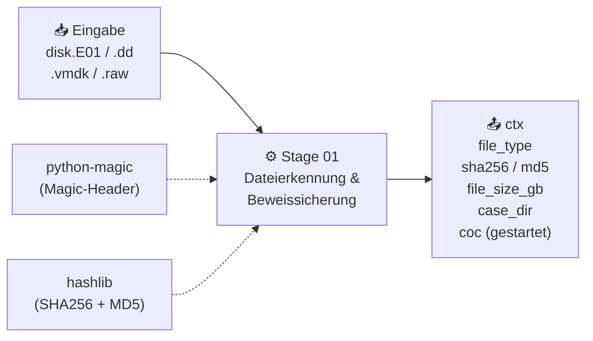

> **Abbildung 5.1:** Stage 01 — Eingabe, Verarbeitung und Ausgabe im PipelineContext *(Quelle: Autor, 2026)*

**Unterstützte Eingabeformate:**

| Format | Magic-Header-Kennung | Beschreibung |
|---|---|---|
| E01 / EWF | `EWF` | Expert Witness Format — forensischer Standard |
| DD / RAW | `data` | Rohes Disk-Image, 1:1-Kopie |
| VMDK | `VMware` | VMware Virtual Disk |
| VHDX | `Microsoft` | Hyper-V Virtual Disk |
| QCoW2 | `QEMU` | QEMU/KVM Virtual Disk |
| AFF | `AFF` | Advanced Forensics Format |

**E01-Besonderheit:** Bei E01-Images enthält der EWF-Container eingebettete Hashwerte, die beim Erstellen des Abbildes berechnet wurden. Die Stage liest diese via `e01_reader.py` aus — ohne das Image nochmals vollständig zu streamen. Falls die eingebetteten Hashes nicht lesbar sind (z.B. beschädigter Header), berechnet die Pipeline SHA256 und MD5 neu über 64-KB-Streaming. Der Wert `ctx.hash_source` unterscheidet beide Fälle: `'E01-eingebettet'` für ausgelesene Hashes und `'Berechnet'` für neu berechnete. Zusätzlich speichert die Stage bei E01-Images zwei Größenangaben: die logische Disk-Größe (unkomprimiert, über `img_stat`) in `ctx.file_size_gb` und die physische Dateigröße der komprimierten E01-Datei in `ctx.file_size_compressed_gb`.

```python
# Auszug stages/stage01_detection.py
mime = magic.from_file(str(path))
ctx.file_type = detect_format(mime)

if ctx.file_type in ('E01', 'EWF'):
    md5, sha1 = read_e01_hashes(path)
    if md5:
        ctx.md5        = md5
        ctx.sha256     = sha1
        ctx.hash_source = 'E01-eingebettet'
    else:
        ctx.sha256, ctx.md5 = compute_both(path)
        ctx.hash_source = 'Berechnet'
else:
    ctx.sha256, ctx.md5 = compute_both(path)
    ctx.hash_source = 'Berechnet'

ctx.case_dir = _create_case_dir(ctx.output_dir)
ctx.coc = ChainOfCustody(
    file_name=path.name, sha256=ctx.sha256,
    md5=ctx.md5, size_gb=ctx.file_size_gb,
    start_time=datetime.utcnow()
)
```

Die Fallordner-Struktur wird hierarchisch nach Datum angelegt (`<year>/<MM_Monat>/<DD_Wochentag>/case_<timestamp>/raw/`), was mehrere parallele Analysen auf demselben System ohne Konflikte ermöglicht.

---

### 5.3.1a Stufe 2: RAM-Analyse (Volatility3)

Stage 02 (RAM-Analyse) ist optional — sie wird nur ausgeführt wenn beim Aufruf ein RAM-Dump via `--ram <pfad>` übergeben wurde. Fehlt der Parameter, setzt die Pipeline `ctx.stage_status['stage_02m'] = 'ÜBERSPRUNGEN'` und fährt ohne Fehler fort.

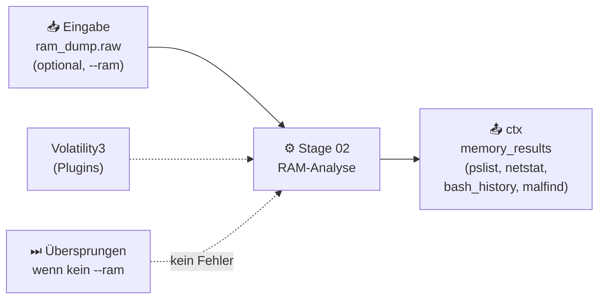

> **Abbildung 5.2:** Stage 02 RAM-Analyse — optionale Ausführung mit Volatility3 *(Quelle: Autor, 2026)*

Stage 02 führt insgesamt **10 Volatility3-Plugins** sequenziell aus:

| Plugin | Zweck | Forensische Relevanz |
|---|---|---|
| `linux.pslist` | Prozessliste mit PIDs, PPIDs, Startzeitpunkten | Laufende Prozesse bei Sicherstellung |
| `linux.pstree` | Prozessbaum (Eltern-Kind-Beziehungen) | Erkennung injizierter Prozesse |
| `linux.netstat` | Offene Netzwerkverbindungen | Aktive C2-Verbindungen |
| `linux.bash` | Bash-Kommandoverlauf aus RAM | History-Manipulation umgehbar |
| `linux.malfind` | Injizierter Code / ausführbarer Speicher | Rootkits, Code-Injection |
| `linux.modules` | Geladene Kernel-Module | Kernel-Rootkits |
| `linux.capabilities` | Prozess-Capabilities (CAP_SYS_ADMIN etc.) | Privilegieneskalation |
| `linux.envars` | Umgebungsvariablen laufender Prozesse | Secrets in Env-Vars |
| `linux.sockstat` | Socket-Statistik (TCP/UDP/Unix) | Offene Ports und Listener |
| `linux.lsof` | Geöffnete Dateien aller Prozesse | Datei-Handles auf gelöschte Dateien |

Jedes Plugin wird als separater Subprozess mit `--output json` aufgerufen. Die zurückgegebenen JSON-Rows werden in `ctx.memory_results` als Dictionary abgelegt (`plugin_name → [row, ...]`). Plugin-Fehler werden einzeln abgefangen — der Ausfall eines Plugins stoppt nicht die übrigen. Das Ergebnis steht Stage 09 (Anti-Forensics) für die Rootkit-Erkennung zur Verfügung: der `malfind`-Output wird direkt auf `hidden`- und `injected`-Keywords geprüft.

```python
# Auszug stages/stage02_memory.py
for plugin in VOL_PLUGINS:
    try:
        out = _run_volatility(ctx.ram_dump_path, plugin)
        results[plugin] = out
    except Exception as e:
        log.warning(f'Plugin {plugin} fehlgeschlagen: {e}')
        results[plugin] = []   # Graceful Degradation pro Plugin

ctx.memory_results = results
```

---

### 5.3.2 Stufe 2: Partition-Layout & Tool-Auswahl

Stage 02 liest die Partitionstabelle des Disk-Images ein und bestimmt für jede Partition das Dateisystem sowie das geeignete Analyse-Werkzeug. Das `TOOL_POOL`-Dictionary ordnet jedem Dateisystemtyp ein primäres Werkzeug zu:

```python
# Auszug stages/stage02_partition_layout.py
TOOL_POOL = {
    'ext4':  ('tsk',    'TSK 4.15 — ext-Dateisysteme'),
    'ext3':  ('tsk',    'TSK 4.15 — ext-Dateisysteme'),
    'ext2':  ('tsk',    'TSK 4.15 — ext-Dateisysteme'),
    'ntfs':  ('tsk',    'TSK 4.15 — NTFS'),
    'fat32': ('tsk',    'TSK 4.15 — FAT32'),
    'exfat': ('tsk',    'TSK 4.15 — exFAT'),
    'vfat':  ('tsk',    'TSK 4.15 — FAT/vFAT'),
    'xfs':   ('xfs_db', 'xfs_db — XFS-nativ (xfsprogs)'),
    'btrfs': ('btrfs',  'btrfs-progs — Btrfs-nativ'),
}
```

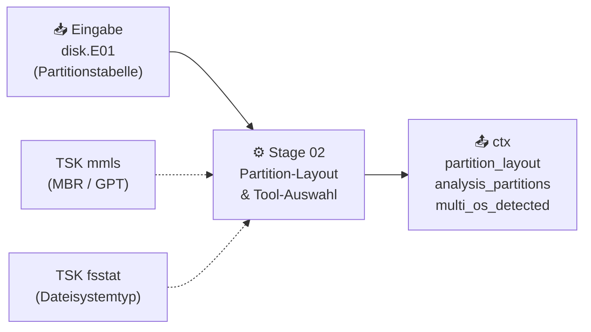

> **Abbildung 5.3:** Stage 02 Partition-Layout — Partitionsanalyse mit TSK *(Quelle: Autor, 2026)*

`mmls` liest die Partitionstabelle (MBR oder GPT) aus dem Image und liefert für jede Partition den Start-Sektor und die Größe. Anschließend ruft `fsstat -o <offset>` pro Partition den Dateisystem-Typ ab — die Ausgabe wird auf bekannte Schlüsselwörter (`ntfs`, `ext4`, `xfs`, `btrfs`, `swap` etc.) geprüft. Partitionen mit unbekanntem Typ werden mit `UNBEKANNT` markiert und von der weiteren Analyse ausgeschlossen.

Die Rollenzuordnung jeder Partition erfolgt per Heuristik: FAT-Partitionen unter 600 MB gelten als Boot-Partitionen, `swap`-Typ-Partitionen als Swap, ext4/ext3/ext2/XFS/Btrfs-Partitionen als `ROOT/DATA` und NTFS-Partitionen als `WINDOWS`. Partitionen der Klassen `SWAP` und `UNBEKANNT` werden nicht analysiert (`SKIP_ROLES`). Die primäre Partition wird als die größte `ROOT/DATA`-Partition definiert.

Ist das präferierte Werkzeug (z.B. `xfs_db`) nicht installiert, prüft `_suggest_tool()` via `shutil.which()` die Verfügbarkeit und fällt auf TSK zurück. Dieser automatische Fallback wird in `tool_reason` als `"TSK (Fallback — xfs_db nicht installiert ⚠️)"` dokumentiert.

#### 5.3.2.1 Multi-OS-Erkennung und Rollenklassifizierung

Für jede `ROOT/DATA`-Partition ruft Stage 02 `target-query -f os` auf, um die OS-Familie zu ermitteln (Debian-Familie, RHEL-Familie, Arch, Alpine). Werden auf dem Image mehrere Partitionen mit unterschiedlichen OS-Familien gefunden, wird `ctx.multi_os_detected = True` gesetzt. Dies ist forensisch relevant: Ein Dual-Boot-System kann auf beiden Partitionen unterschiedliche Log-Dateien und Benutzerkonten enthalten, die separat profiliert werden müssen.

Die OS-Erkennung beschränkt sich bewusst auf `ROOT/DATA`-Partitionen: Boot-Partitionen (EFI/VFAT) würden bei einer uneingeschränkten Analyse fälschlicherweise eine OS-Familie zugewiesen bekommen — da sie keine `/etc/os-release` enthalten, würde das Ergebnis leer bleiben oder das OS der Haupt-Partition irrtümlich übernommen.

#### 5.3.2.2 Interaktive Tool-Auswahl im Manual-Modus

Im `--mode manual` wird dem Analysten für jede analysierbare Partition ein interaktives Auswahlpanel angezeigt. Die Rich-Tabelle zeigt Dateisystem, Größe, erkannte Rolle, detektiertes Betriebssystem sowie alle verfügbaren Analyse-Werkzeuge mit Verfügbarkeitsstatus und Empfehlung. Die Eingabe einer Ziffer (1–4) wählt das Werkzeug; eine leere Eingabe übernimmt die automatische Empfehlung. Nicht installierte Werkzeuge lösen bei Auswahl einen automatischen TSK-Fallback aus, der dem Analysten angezeigt wird. Dieser Modus ist für Szenarien gedacht, in denen der Analyst gezielt das Werkzeug für eine spezifische Partition steuern möchte — etwa bei exotischen Dateisystemen oder bekannten TSK-Einschränkungen.

---

### 5.3.3 Stufe 3: System-Profiling pro Partition

Stage 03 ermittelt das vollständige Systemprofil. Als Primärquelle dient `target-query` (Dissect-Framework), das OS-Metadaten direkt aus dem Disk-Image liest ohne es zu mounten. Bei unzureichenden Ergebnissen greift TSK als Fallback auf einzelne Dateien (`/etc/os-release`, `/etc/passwd`) zurück.

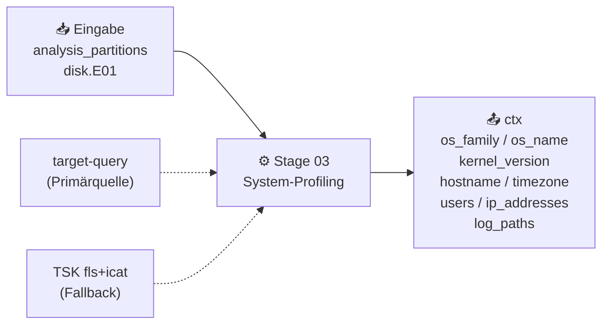

> **Abbildung 5.4:** Stage 03 — System-Profiling mit target-query und TSK-Fallback *(Quelle: Autor, 2026)*

`target-query` wird für mehrere Felder aufgerufen: `os` (OS-Release-Inhalt), `version` (Kernel-Version), `hostname`, `timezone`, `users` und `ips`. Die Ergebnisse werden aus der `<Target ...>-Zeile` im Stdout extrahiert. Ein bekanntes Problem besteht bei `target-query -f version`: das Plugin gibt gelegentlich den OS-Namen (`Ubuntu 20.04.5 LTS`) statt der Kernel-Version (`5.15.0-1031-aws`) zurück. Stage 03 enthält eine Validierungsregel — echte Kernel-Versionen beginnen mit dem Muster `^\d+\.\d+`. Schlägt die Validierung fehl, wird die Kernel-Version alternativ aus `/boot/vmlinuz-*`-Dateinamen (via Partition-Index) oder der GRUB-Konfiguration ermittelt.

Die Zeitzone wird im Format `Europe/Berlin (UTC+02:00)` gespeichert (`ctx.timezone_display`), was für den Report und die Timestamp-Normalisierung in Stage 08 verwendet wird. Die Fallback-Kette für die OS-Erkennung ist zweistufig: Enthält die `target-query os`-Ausgabe kein `KEY=VALUE`-Muster (also kein `os-release`-artiger Inhalt), liest die Pipeline `/etc/os-release` direkt über die TSK-Kette `mmls → fls → icat`.

Der per-Partition-Profiling-Prozess erstellt für jede analysierbare Partition via `fls -r -p -o <offset>` einen vollständigen Datei-Index (Dictionary `{pfad: inode}`). Dieser Index erlaubt es, beliebige Systemdateien per Inode via `icat` zu lesen — ohne das Image zu mounten.

#### 5.3.3.1 Per-Partition Profiling (OS, Kernel, Install-Zeit, Nutzungszeitraum)

Für die primäre Partition werden zusätzlich zu OS und Kernel folgende Metadaten ermittelt:

**Installationszeitpunkt:** Die Schätzung des OS-Installationszeitpunkts erfolgt über eine Prioritätskette aus vier Quellen: (1) Installer-Logs (`/var/log/installer/syslog` bei Debian, `/var/log/anaconda/syslog` bei RHEL) enthalten den ersten Timestamp des Installationsvorgangs. (2) Für Alpine-Systeme wird die APK-Paketdatenbank (`/var/lib/apk/db/installed`) ausgewertet — jedes Paket enthält einen Unix-Timestamp (`t:<epoch>`), der Kleinste entspricht dem frühesten Installations-Zeitpunkt. (3) Als Fallback dient die Modifikationszeit von `/etc/machine-id` (via `istat`), die beim ersten Systemstart gesetzt wird. (4) Als letzter Fallback die mtime von `/etc/hostname`.

**Nutzungszeitraum:** Stage 03 liest den ersten und letzten Timestamp aus allen Log-Dateien (`syslog`, `auth.log`, `messages` je nach OS-Familie) und bildet daraus den forensisch relevanten Nutzungszeitraum (`usage_period.first_activity`, `usage_period.last_activity`). Dies gibt dem Analysten eine schnelle Übersicht, in welchem Zeitfenster das System aktiv war.

**Kernel-Diskrepanz:** Alle installierten Kernel-Versionen werden aus `/boot/vmlinuz-*`-Einträgen im Partition-Index gesammelt. Der tatsächlich geladene Kernel wird zusätzlich aus Text-Logs (`kern.log`, `messages`) oder — bei LZ4-komprimierten systemd-Journals — via `journalctl --file` auf einer temporären Kopie ermittelt. Eine Diskrepanz zwischen dem GRUB-Default-Kernel und dem tatsächlich geladenen Kernel wird in `ctx.grub_config` gespeichert und später von Stage 09 als Anti-Forensics-Treffer gewertet.

```python
# Auszug stages/stage03_profiling.py — target-query Wrapper
result = subprocess.run(
    ['target-query', '-f', 'os', str(image_path)],
    capture_output=True, text=True, timeout=30
)
raw = _parse_target_line(result.stdout) or result.stdout.strip()
# Validierung: nur wenn Ausgabe KEY=VALUE-Muster enthält
if raw and '=' in raw and raw.lower() not in ('linux', 'unknown', ''):
    return raw
# Fallback: /etc/os-release direkt via TSK fls+icat lesen
return _read_os_release_tsk(image_path)
```

#### 5.3.3.2 Netzwerk- und Systemkonfiguration

Die Netzwerkkonfiguration wird aus vier möglichen Quellen gelesen, je nach Betriebssystem-Familie: `/etc/resolv.conf` (DNS-Server, Search-Domains), `/etc/network/interfaces` (Debian/Alpine: Interfaces, Gateway), Netplan-YAML-Dateien (Ubuntu: `/etc/netplan/*.yaml`, mit YAML-Parser und Regex-Fallback) sowie RHEL-spezifische `ifcfg-*`-Dateien.

MAC-Adressen werden aus drei Quellen zusammengeführt: DHCP-Lease-Dateien (`/var/lib/dhcp/dhclient.leases`), NetworkManager-Verbindungsprofile (`.nmconnection`-Dateien) und `udev`-Persistent-Net-Rules (`/etc/udev/rules.d/70-persistent-net.rules`). Die gesammelten MAC-Hinweise werden in `ctx.primary_partition_profile['net_config']['mac_hints']` gespeichert.

Für die Virtualisierungserkennung wertet Stage 03 den Partition-Index auf charakteristische Dateipfade aus: VMware-Tools (`usr/bin/vmtoolsd`), VirtualBox-Gasterweiterungen (`usr/bin/vboxclient`), KVM-Guest-Agent (`usr/bin/qemu-ga`), Docker-Sentinel (`.dockerenv`), Cloud-Provider-Agents (AWS SSM Agent, Azure `waagent`, GCP Ops Agent). Das Ergebnis (`VMware`, `VirtualBox`, `KVM/QEMU`, `Docker`, `Bare-Metal` etc.) fließt in den Report-Abschnitt zur Systemkonfiguration.

Die SSH-Serverkonfiguration (`/etc/ssh/sshd_config`) wird auf forensisch relevante Direktiven geprüft: `PermitRootLogin`, `PasswordAuthentication`, `PubkeyAuthentication`, `Port`, `AllowUsers`, `DenyUsers`, `MaxAuthTries`. Ein `PermitRootLogin yes` in Kombination mit `PasswordAuthentication yes` ist ein erhöhter Risikofaktor, der im Report hervorgehoben wird.

#### 5.3.3.3 Nutzer-Profiling

Das Nutzer-Profiling nutzt `target-query -f users` als Primärquelle. Die zurückgegebene Ausgabe wird im `/etc/passwd`-Format geparst: Username, UID, GID, Home-Verzeichnis, Shell. Systemnutzer (UID < 1000) werden gegen eine OS-spezifische Whitelist (`KNOWN_SYSTEM_USERS`) abgeglichen — unbekannte Systemnutzer werden als `is_unexpected = True` markiert, was auf manipulierte Systemkonten hindeuten kann.

Enthält die `target-query`-Ausgabe keinen Nutzer mit UID ≥ 1000, fällt Stage 03 auf TSK zurück und liest `/etc/passwd` direkt per Inode. Diese Fallback-Logik basiert auf der Beobachtung, dass `target-query` gelegentlich nur `root` parst und reguläre Nutzkonten überspringt.

Für jeden Nutzer werden weitere Attribute angereichert:

- **Letzte Login-Zeit:** Aus `/var/log/lastlog` (binäres Format, 292 Bytes pro UID, struct mit Unix-Timestamp, Terminal, Hostname)
- **Login-Methoden:** Aus `/var/log/wtmp` (binär, 384 oder 392 Byte pro Eintrag je nach Architektur) werden Methoden wie `ssh_remote`, `ssh_local` und `console` abgeleitet; aus `auth.log` oder `secure` wird `ssh_key` vs. `ssh_password` unterschieden
- **Shell-Histories:** Vorhandene History-Dateien (`.bash_history`, `.zsh_history`, `.fish_history`) werden im Partition-Index geprüft
- **Sudo-Rechte:** `/etc/sudoers` und alle Dateien in `/etc/sudoers.d/` werden auf `%user ALL=`-Einträge geparst
- **Gruppenzugehörigkeit:** `/etc/group` wird auf Member-Listen jeder Gruppe ausgewertet
- **Erstellungszeit:** Aus `auth.log`/`secure` werden `useradd`-Events für Erstellungszeitpunkte extrahiert

Die erkannten nicht-systemischen Nutzer (`notable_users`) und unerwarteten Systemnutzer (`unexpected_users`) werden im PipelineContext gespeichert und im PDF-Report in einer separaten Nutzer-Tabelle dargestellt.

---

### 5.3.4 Stufe 5: Disk-Forensik mit The Sleuth Kit

Stage 05 führt die vollständige Dateisystem-Extraktion durch. `fls` listet alle Dateien und Verzeichniseinträge inklusive gelöschter Inodes; `icat` extrahiert jede Log-relevante Datei in den Fallordner. `tsk_recover` stellt Datei-Fragmente aus ungenutztem Datenträgerbereich wieder her. Für XFS-Partitionen wird `xfs_db` als natives Werkzeug bevorzugt.

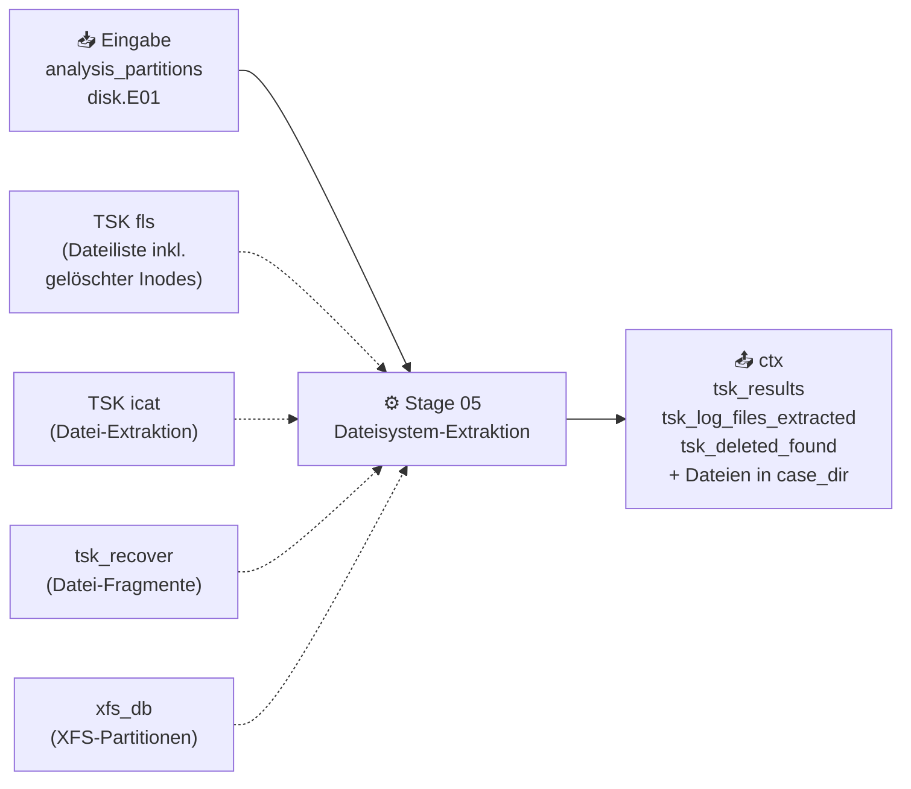

> **Abbildung 5.5:** Stage 05 — Dateisystem-Extraktion mit The Sleuth Kit *(Quelle: Autor, 2026)*

`fls -r -o <offset>` erstellt eine vollständige rekursive Dateiliste aller Inodes. Gelöschte Einträge sind im Output durch den Präfix `/-` oder ein führendes `*` erkennbar und werden in `ctx.tsk_deleted_found` gezählt. Nicht alle gelöschten Einodes können wiederhergestellt werden: Ist ein gelöschter Inode noch im Verzeichnisbaum sichtbar (`fls`-Treffer), aber der tatsächliche Dateiinhalt bereits durch neue Daten überschrieben, schlägt `icat` leer fehl. `tsk_recover` hingegen scangt den ungenutzten Datenträgerbereich nach noch vorhandenen Datei-Fragmenten — unabhängig von Inode-Einträgen. Dieses unterschiedliche Vorgehen erklärt, warum die Zahl der wiederhergestellten Dateien (`ctx.tsk_deleted_recovered`) die Zahl der gefundenen gelöschten Inodes (`ctx.tsk_deleted_found`) überschreiten kann: `tsk_recover` findet Fragmente auch ohne korrespondierenden Verzeichniseintrag.

Die Log-Datei-Extraktion ist durch eine `LOG_KEYWORDS`-Liste gefiltert: Nur Dateipfade mit Schlüsselwörtern wie `var/log`, `bash_history`, `auth.log`, `dpkg.log`, `apache`, `nginx`, `docker` etc. werden per `icat` extrahiert. Die Extraktion läuft via `ThreadPoolExecutor` — mehrere `icat`-Prozesse laufen parallel, was bei Disk-Images mit vielen Log-Dateien die Extraktionszeit deutlich reduziert.

Ein wichtiger Bug-Fix betrifft `tsk_recover`: In einer früheren Version wurde `tsk_recover <image> <out>` ohne Offset-Parameter aufgerufen. Dabei scannte das Tool das gesamte Disk-Image aller Partitionen gleichzeitig, was bei großen Images (5,7 GB und mehr) den OOM-Killer des Linux-Kernels auslöste und den Prozess abbrach. Der Fix war `tsk_recover -o <offset>` pro analysierter Partition, was RAM-isoliert und stabil läuft.

Alle extrahierten Dateien werden nach der Extraktion mit SHA256 via `compute_both()` (64-KB-Streaming) gehasht. Die Hashwerte fließen in das `ChainOfCustody`-Objekt (`coc.add_file_hash()`), sodass im finalen CoC-PDF jede extrahierte Datei mit ihrem Hash protokolliert ist.

#### 5.3.4.1 MACtime Timeline-Rekonstruktion

Nach Abschluss von Stage 06 (Log-Parsing) wird `run_mactime_after_stage6()` aufgerufen. Diese Funktion liegt in `stage05_tsk.py` und erstellt aus den extrahierten Dateien eine MACtime-Zeitlinie im Body-File-Format.

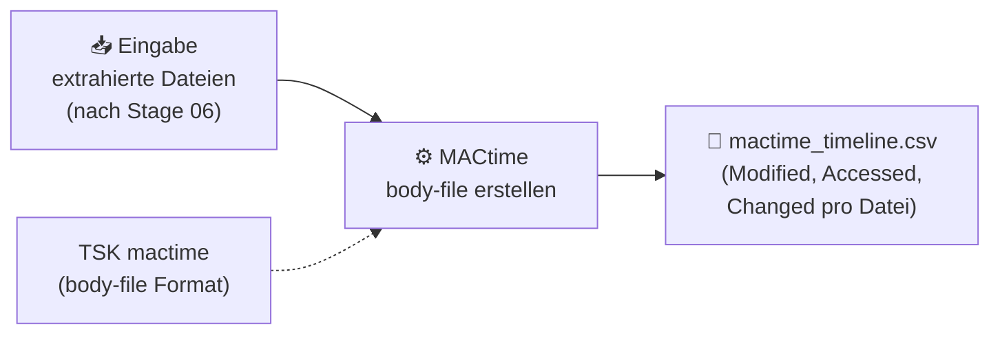

> **Abbildung 5.6:** MACtime-Zeitlinie — Timeline-Rekonstruktion nach Stage 06 *(Quelle: Autor, 2026)*

Die MACtime-Rekonstruktion ist zweistufig: Zunächst generiert `fls -m / -r -o <offset>` ein Body-File im TSK-Format (Pipe-separiertes Format mit MD5, Dateiname, Inode, Mode, UID, GID, Größe sowie allen vier Timestamps: Modified, Accessed, Changed, Birth). Anschließend konvertiert `mactime -b -` (via Stdin-Pipe) das Body-File in eine chronologisch sortierte Timeline.

Das Ergebnis wird nicht als Datei gespeichert, sondern **direkt per Streaming** in die DuckDB-Datenbank (`events.db`) eingefügt: Jede Zeile der mactime-Ausgabe wird geparst und als `ForensicEvent` mit dem `macb`-Feld (z.B. `m..b` für Modified und Birth) als Event-Typ gespeichert. Der Batch-Insert erfolgt in Schritten von 1.000 Events. Der Hauptgrund für die Ausführung nach Stage 06 ist, dass `events.db` zu diesem Zeitpunkt bereits existiert — MACtime schreibt in die bestehende Datenbank, anstatt eine neue anzulegen. Die Schweregrad-Klassifizierung berücksichtigt Dateipfade in temporären Verzeichnissen (`/tmp/`, `/var/tmp/`, `/dev/shm`) als `medium` und gelöschte Einträge (Präfix `*`) als `high`.

---

### 5.3.5 Stufe 3.5: Basic Checks

Stage 03.5 prüft die Konsistenz der Log-Infrastruktur. Für jede erkannte Linux-Distribution wird eine Liste erwarteter Log-Dateien gegen die tatsächlich extrahierten Dateien abgeglichen. **Wichtig:** Stage 03.5 läuft nach Stage 05, damit auch wiederhergestellte gelöschte Logs einbezogen werden.

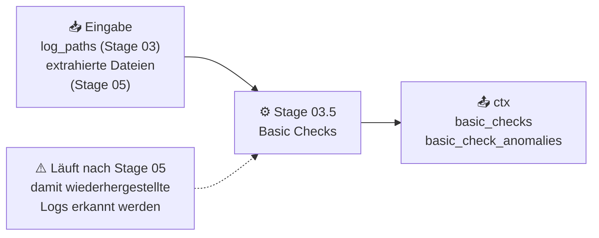

> **Abbildung 5.7:** Stage 03.5 — Konsistenzprüfung der Log-Infrastruktur *(Quelle: Autor, 2026)*

Die Prüfliste `EXPECTED_SERVICES` ist nach OS-Familie aufgeteilt. Jede Familie enthält zwei Kategorien:

- **Pflicht-Logs (`mandatory`):** Immer erwartete Logs, deren Fehlen eine Anomalie darstellt. Debian: `syslog`, `auth.log`, `kern.log`. RHEL: `messages`, `secure`. Arch: `pacman.log`. Alpine: `messages`, `auth.log`.
- **Bedingte Logs (`if_installed`):** Logs, die nur bei installierten Diensten erwartet werden (Apache, Nginx, MySQL, Samba, Docker, auditd, fail2ban).

Drei Anomalie-Typen werden unterschieden:

1. **`mandatory_missing`:** Ein Pflicht-Log fehlt vollständig — z.B. kein `/var/log/syslog` auf einem Debian-System. Dies kann auf Log-Wiping hinweisen.
2. **`log_without_install`:** Eine Log-Datei ist vorhanden, das zugehörige Paket aber nicht installiert — z.B. Apache-Access-Log ohne `apache2`-Paket. Dies ist forensisch verdächtig.
3. **`install_without_log`:** Ein Paket ist installiert, aber die erwartete Log-Datei fehlt — z.B. `mysql-server` installiert, aber kein `/var/log/mysql/error.log`. Kann auf selektives Löschen hindeuten.

Der Präsenzabgleich nutzt Basename-Vergleiche, da `ctx.tsk_extracted_filenames` nur die Dateinamen ohne vollständigen Pfad enthält (z.B. `syslog` statt `/var/log/syslog`). Stage 03.5 ist bewusst einfach gehalten — sie liefert keine Tiefenanalyse der Log-Inhalte, sondern eine schnelle Übersicht zur Vollständigkeit der forensischen Datenbasis für den Analysten.

---

### 5.3.6 Stufe 6: Log-Parsing (38 Parser)

Stage 06 verarbeitet alle extrahierten Log-Dateien mit 38 spezialisierten Parsern. Die Parser laufen parallel über einen `ProcessPoolExecutor`; Events werden in Batches in DuckDB geschrieben.

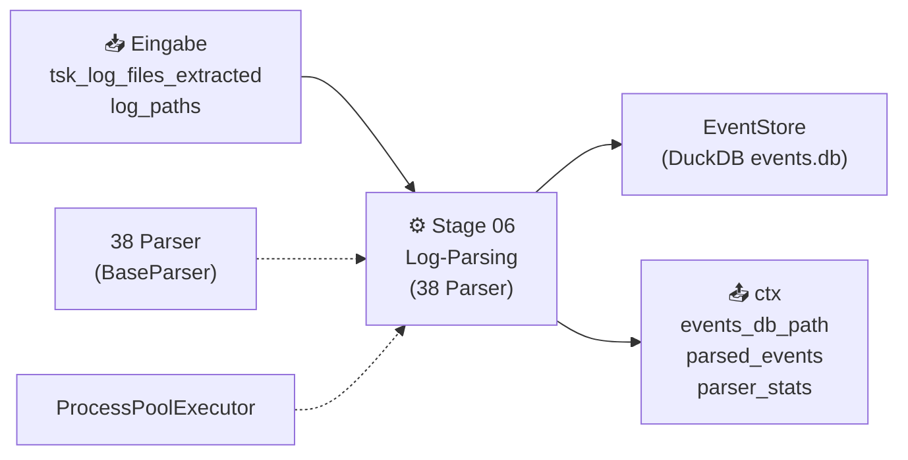

> **Abbildung 5.8:** Stage 06 — Paralleles Log-Parsing mit 38 Parsern *(Quelle: Autor, 2026)*

#### 5.3.6.1 Parser-Architektur & automatisches Routing

Jeder Parser erbt von der abstrakten Klasse `BaseParser` und implementiert zwei Methoden:

```python
# Auszug parsers/base_parser.py
class BaseParser(ABC):
    @abstractmethod
    def can_parse(self, file_path: Path) -> bool:
        """Gibt True zurück wenn dieser Parser für die Datei zuständig ist."""

    @abstractmethod
    def parse(self, file_path: Path) -> List[ForensicEvent]:
        """Parst die Datei und gibt normalisierte Events zurück."""
```

Stage 06 iteriert über alle Parser und ruft `can_parse()` auf. Der erste passende Parser übernimmt die Datei. `PlasaFallbackParser` wird bewusst aus dem Routing-Durchlauf ausgeschlossen und nur explizit am Ende aufgerufen, wenn kein spezialisierter Parser zuständig ist:

```python
# Auszug stages/stage06_logs.py — route_and_parse()
def route_and_parse(log_file: Path) -> List[ForensicEvent]:
    for parser in ALL_PARSERS:
        if parser.name == 'plaso_fallback':
            continue      # Plaso nie als erstes matchen
        if parser.can_parse(log_file):
            return parser.safe_parse(log_file)
    return PlasaFallbackParser().safe_parse(log_file)
```

Die Parallelisierung erfolgt via `ProcessPoolExecutor`: Jeder Worker-Prozess erhält eine Log-Datei und führt `route_and_parse()` aus. Der Hauptprozess sammelt die Ergebnisse via `as_completed()` und schreibt sie in Batches von 1.000 Events in DuckDB. Der Batch-Insert vermeidet den Overhead einzelner INSERT-Statements bei großen Event-Mengen. Die Anzahl der Worker ist über `--workers` konfigurierbar (Standard: 4).

Der `ProcessPoolExecutor` wurde gegenüber `ThreadPoolExecutor` gewählt, weil das Python GIL für CPU-intensive Regex-Operationen (Log-Parsing) threadseitige Parallelität verhindert. Separate Prozesse laufen auf echten CPU-Kernen parallel.

#### 5.3.6.2 Die 38 Linux-Log-Parser

Die 38 Parser decken alle gängigen Linux-Log-Formate ab:

| Gruppe | Parser | Log-Dateien |
|---|---|---|
| System-Logs | `JournaldParser`, `WtmpParser`, `UtmpParser`, `LastlogParser`, `EVTXParser` | journald, wtmp, utmp, lastlog, Windows EVTX |
| Auth & Security | `AuthLogParser`, `SSHParser`, `CronParser`, `AuditParser`, `Fail2BanParser`, `UFWParser` | auth.log/secure, SSH-Logs, cron, audit.log, fail2ban.log, ufw.log |
| Kernel & System | `KernLogParser`, `BootLogParser`, `DaemonLogParser`, `SyslogParser` | kern.log, boot.log, daemon.log, syslog/messages |
| Paket-Manager | `DpkgParser`, `AptHistoryParser`, `YumParser`, `DnfParser`, `PacmanParser` | dpkg.log, apt/history.log, yum.log, dnf.log, pacman.log |
| Web-Server | `ApacheAccessParser`, `ApacheErrorParser`, `NginxAccessParser`, `NginxErrorParser` | Apache/Nginx access + error logs |
| Datenbanken | `MySQLErrorParser`, `PostgreSQLParser`, `MongoDBParser` | MySQL/MariaDB, PostgreSQL, MongoDB |
| User-Aktivität | `BashHistoryParser`, `ZshHistoryParser`, `FishHistoryParser` | .bash_history, .zsh_history, .fish_history |
| Netzwerk & Services | `PostfixMailParser`, `FTPParser`, `SambaParser`, `OpenVPNParser` | Postfix, FTP, Samba, OpenVPN |
| Container & Sonstiges | `DockerParser`, `ContainerdParser`, `IISLogParser`, `PlasaFallbackParser` | Docker, Containerd, IIS, generischer Fallback |

Jeder spezialisierte Parser kennt das genaue Format seiner Ziel-Log-Datei. `AuthLogParser` beispielsweise erkennt das Syslog-Format (`MMM DD HH:MM:SS hostname service[PID]: message`) und extrahiert Felder wie `event_type` (`ssh_login`, `sudo_command`, `failed_login`), `user`, `source_ip` und `severity`. Diese strukturierten Felder sind es, die erst die spätere IOC-Extraktion (Stage 07) und Anti-Forensics-Erkennung (Stage 09) präzise machen.

#### 5.3.6.3 Hayabusa EVTX-Analyse (konditionell)

Hayabusa wird nur gestartet wenn EVTX-Dateien (Windows Event Logs) im extrahierten Material gefunden werden. Die Pipeline prüft nach dem regulären Log-Parsing alle Extraktionsordner auf `.evtx`-Dateien. Sind keine vorhanden, wird Stage 4.3 als `'ÜBERSPRUNGEN — keine EVTX-Dateien'` protokolliert.

Sind EVTX-Dateien vorhanden, führt Hayabusa eine Sigma-regelbasierte Analyse durch. Sigma-Regeln beschreiben verdächtige Windows-Event-Muster in einem herstellerunabhängigen YAML-Format. Hayabusa übersetzt diese Regeln intern in Event-ID-Abfragen gegen die EVTX-Struktur. Die Ausgabe erfolgt als CSV mit den Feldern: Zeitstempel, Regelname, Schweregrad (`informational`, `low`, `medium`, `high`, `critical`), Sigma-Tags (z.B. `attack.execution`, `attack.t1059`). Jeder Hayabusa-Treffer wird als `ForensicEvent` mit `source='hayabusa'` in DuckDB eingefügt und in `ctx.hayabusa_hits` gezählt. Der Schweregrad-Filter ist über `min_level` in `config.yaml` konfigurierbar.

---

### 5.3.7 Stufe 7: IOC-Extraktion

Stage 07 extrahiert Indicators of Compromise aus dem gesamten extrahierten Dateibestand.

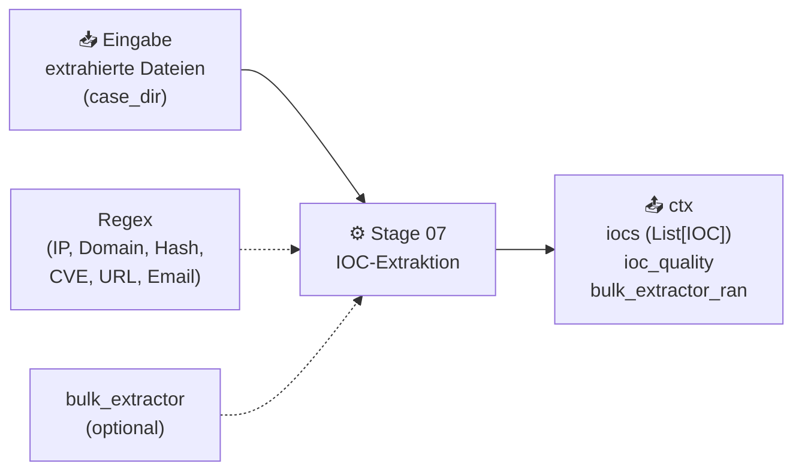

> **Abbildung 5.9:** Stage 07 — IOC-Extraktion per Regex und optionalem Carving *(Quelle: Autor, 2026)*

Stage 07 kombiniert zwei komplementäre Extraktionsmethoden:

**Regex-Extraktion** läuft über alle Events in DuckDB sowie die Ergebnisse aus Memory-Analyse und Disk-Artefakten. Neun IOC-Typen werden erkannt:

| IOC-Typ | Regex-Pattern | Beispiel |
|---|---|---|
| `ip` | IPv4-Adresse (0–255 je Oktett) | `192.168.1.100` |
| `ipv6` | Vollständige IPv6-Adresse | `2001:0db8::1` |
| `domain` | Fully Qualified Domain Name | `evil.example.com` |
| `url` | HTTP/HTTPS-URL | `https://c2.attacker.net/beacon` |
| `hash_md5` | 32 hex-Zeichen | `d41d8cd98f00b204e9800998ecf8427e` |
| `hash_sha256` | 64 hex-Zeichen | `e3b0c44298fc1c149...` |
| `email` | E-Mail-Adresse | `attacker@evil.com` |
| `cve` | CVE-Nummer | `CVE-2021-44228` |
| `registry_key` | Windows Registry-Pfad | `HKEY_LOCAL_MACHINE\...\Run` |

Jeder IOC-Treffer wird mit Quellinformation (`event.source`) und Kontext (±40 Zeichen um den Match) gespeichert. Deduplizierung erfolgt über ein `seen`-Set aus `(type, value)`-Tupeln.

**bulk_extractor** wird optional aufgerufen (deaktivierbar via `ctx.skip_bulk_extractor`). Das Tool analysiert das Disk-Image per Carving — d.h. es sucht byte-Muster direkt im Rohdaten-Stream, unabhängig vom Dateisystem. Dadurch werden IOCs in gelöschten Bereichen oder fragmentierten Dateien gefunden, die dem Datei-Parser entgehen. bulk_extractor schreibt Ergebnisse in typisierte Textdateien: `ip.txt`, `email.txt`, `url.txt`, `domain.txt`, `md5.txt`. Jede Datei wird eingelesen und in `IOC`-Objekte mit `source='bulk_extractor'` konvertiert.

Das Qualitäts-Label `ctx.ioc_quality` wird auf `'MITTEL'` gesetzt wenn Stage 05 TSK nutzte (und kein Dissect-Vollzugriff vorlag). Für den Analysten signalisiert dies, dass die IOC-Extraktion auf Basis von extrahierten Dateien (nicht Rohdaten-Mounting) erfolgte.

---

### 5.3.8 Stufe 8: Datennormalisierung

Stage 08 normalisiert alle Zeitstempel in der DuckDB-Datenbank auf UTC.

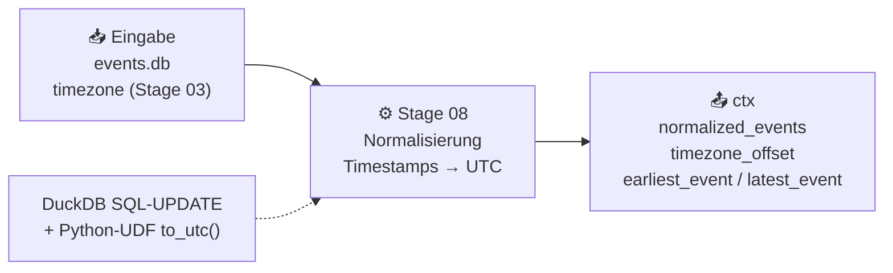

> **Abbildung 5.10:** Stage 08 — UTC-Normalisierung aller Events per SQL-UPDATE *(Quelle: Autor, 2026)*

Die Normalisierung erfolgt per SQL-UPDATE mit einer Python-UDF (User Defined Function): Die Funktion `to_utc(ts_str, tz)` aus `utils/timestamp.py` nimmt einen Timestamp-String und einen Zeitzonennamen entgegen und gibt einen ISO-8601-UTC-String zurück. DuckDB erlaubt die Registrierung von Python-Funktionen als SQL-UDFs, was einen reinen SQL-UPDATE auf allen Zeilen der Events-Tabelle ermöglicht — ohne die gesamte Datenbank in den RAM zu laden.

Die `to_utc()`-Funktion nutzt `python-dateutil` für das Parsing beliebiger Timestamp-Formate: ISO-8601, Syslog (`Jan  1 12:00:00`), Apache (`01/Jan/2024:12:00:00 +0200`), Epoch (Unix-Timestamps), sowie diverse proprietäre Formate. Fehlerhaft formatierte Timestamps (z.B. `0001-01-01 00:00:00` als Null-Datum, oder Zukunfts-Timestamps aus dem Jahr 2034) werden übergeben und nicht verändert — der Fehler wird in der Event-Qualität protokolliert.

Die Systemzeitzone aus Stage 03 (`ctx.timezone`) wird als Kontext für alle Timestamps genutzt, bei denen keine explizite Zeitzone im Log-Eintrag angegeben ist. Nach der Normalisierung werden alle Events chronologisch sortiert und in `ctx.normalized_events` geladen. Frühestes und letztes Event werden im Format `2024-01-15 08:23:11 UTC  (09:23:11 Europe/Berlin)` gespeichert.

---

### 5.3.9 Stufe 9: Anti-Forensics-Erkennung

Stage 09 prüft das Analysematerial auf Indikatoren für Anti-Forensics-Techniken.

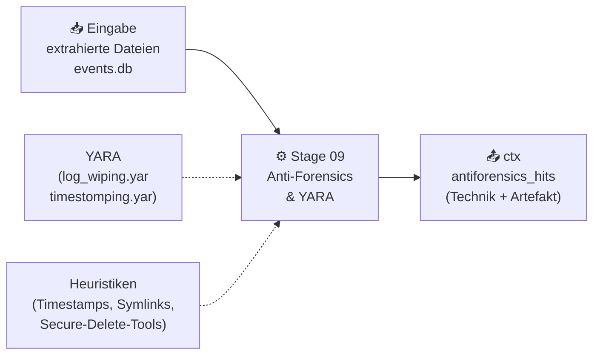

> **Abbildung 5.11:** Stage 09 — Anti-Forensics-Erkennung mit YARA und Heuristiken *(Quelle: Autor, 2026)*

Stage 09 führt 13 spezialisierte Prüfungen durch, die aus unterschiedlichen Datenquellen schöpfen:

**Keyword-basierte Checks** durchsuchen `ctx.normalized_events`:

- **Timestomping:** Schlüsselwörter `timestomp`, `touch -t`, `setfiletime`, `$SI`, `$FN` in Event-Messages (Schweregrad: `high`)
- **Log-Wiping:** Muster wie `> /var/log`, `truncate -s 0`, `rm -f /var/log`, `echo "" > /var/log`, `shred /var/log` (Schweregrad: `critical`)
- **Rootkit-Indikatoren:** `insmod`, `modprobe`, `LD_PRELOAD`, `/proc/kcore`, `ptrace`, `sys_call_table` — ergänzt durch `malfind`-Treffer aus Volatility3 (Schweregrad: `critical`)
- **Secure-Delete-Tools:** `shred`, `srm`, `wipe`, `bleachbit`, `dd if=/dev/zero`, `dd if=/dev/urandom` im Kommandoverlauf (Schweregrad: `high`)

**YARA-Scan:** Alle extrahierten Dateien unter 50 MB werden gegen YARA-Regeln aus `data/yara-rules/` gescannt. Der Regelsatz ist über `--yara`-Parameter konfigurierbar (`custom` für projektspezifische Regeln, `linux` für das Linux-Regelwerk, `full` für alle verfügbaren Regeln). Jede YARA-Regel-Übereinstimmung erzeugt einen Treffer mit Regelname und Tags.

**Stage-03-Daten (strukturierte Anti-Forensics-Checks):**

- **`/dev/null`-Symlinks:** Der Partition-Index aus Stage 03 enthält alle Symlinks (`fls l/l`-Einträge). Stage 09 prüft ob kritische Log-Dateien oder Shell-Histories auf `/dev/null` zeigen — eine bekannte Technik zur vollständigen Unterdrückung der Protokollierung (Schweregrad: `critical`).
- **`rc.local`-Anti-Forensics:** Der Inhalt von `/etc/rc.local` wird auf Startup-Kommandos untersucht, die Log-Dateien löschen, Symlinks auf `/dev/null` erstellen oder Logging-Services beenden. Für Alpine werden zusätzlich `/etc/local.d/*.start`-Dateien geprüft.
- **GRUB-Speicher-Parameter:** GRUB-Konfigurationen werden auf Parameter wie `init_on_free=1` (RAM-Seiten sofort auf null setzen) und `page_poison=1` (Speicherseiten mit `0xAA` überschreiben) geprüft, die post-mortem RAM-Forensik erschweren.
- **Kernel-Compile-Flags:** Einkompilierte Kernel-Flags wie `CONFIG_INIT_ON_FREE_DEFAULT_ON=y` aus `/boot/config-<kernel>` zeigen, ob der Kernel nativ Anti-Forensics-Funktionen aktiviert hat.
- **ExecStop-Wiping:** Systemd-Service-Dateien und Alpine-OpenRC-Skripte werden auf `ExecStop`-Direktiven mit Wiping-Tools (`sdmem`, `secure-delete`, `wipe`, `srm`) untersucht.
- **Swap-Anomalie:** Fehlt auf einem System mit Desktop-Indikatoren eine Swap-Konfiguration, kann das auf bewusstes Vermeiden von Swap-basierter RAM-Forensik hinweisen.
- **Kernel-Diskrepanz:** GRUB-Default-Kernel vs. tatsächlich geladener Kernel (aus Kernel-Logs oder Journal) — eine Abweichung kann auf manipulierte Boot-Konfiguration hindeuten.
- **Journal/Wtmp-Konsistenz:** Sind in `wtmp` Login-Sessions eingetragen, aber keine `session opened`-Events in den Logs vorhanden, deutet das auf selektive Log-Manipulation hin.

Jeder Treffer wird als Dictionary mit `type`, `file`, `details`, `severity` und `source` gespeichert. Die Gesamtliste `ctx.antiforensics_hits` fließt in Stage 13 (Qualitätsbewertung) und Stage 14 (Report).

---

### 5.3.10 Stufe 13: Qualitätsbewertung & Fehler-Handling

Stage 13 bewertet die Gesamtqualität des Durchlaufs anhand aller protokollierten Stage-Fehler.

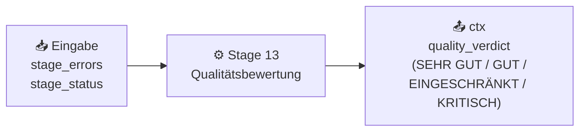

> **Abbildung 5.12:** Stage 13 — Qualitätsbewertung anhand protokollierter Fehler *(Quelle: Autor, 2026)*

Die Qualitätsbewertung basiert auf der Anzahl der Fehler in `ctx.stage_errors`:

| Fehleranzahl | Urteil | Bedeutung |
|---|---|---|
| 0 | `SEHR GUT` | Alle Stages erfolgreich — Vollständige Analyse |
| 1–2 | `GUT` | Einzelne Tools fehlen oder schlugen fehl |
| 3–5 | `EINGESCHRÄNKT` | Mehrere Stages fehlgeschlagen — Teilergebnis |
| > 5 | `KRITISCH` | Wesentliche Teile der Analyse nicht ausführbar |

Das Urteil wird im Terminal in einem farbigen Rich-Panel angezeigt und fließt in das PDF-Report (Executive Summary) und das JSON-Export ein. Zusätzlich listet Stage 13 alle Stage-Status-Meldungen (`ctx.stage_status`) aus — einschließlich übersprungener Stages (`ÜBERSPRUNGEN`) und erfolgreicher Stages (`AKTIV`). Dies gibt dem Analysten eine vollständige Übersicht, welche Komponenten der Pipeline mit welchem Ergebnis durchlaufen wurden.

---

### 5.3.11 Stufe 14: Export & Archivierung

Stage 14 bündelt alle Ergebnisse und erstellt die Ausgabedokumente.

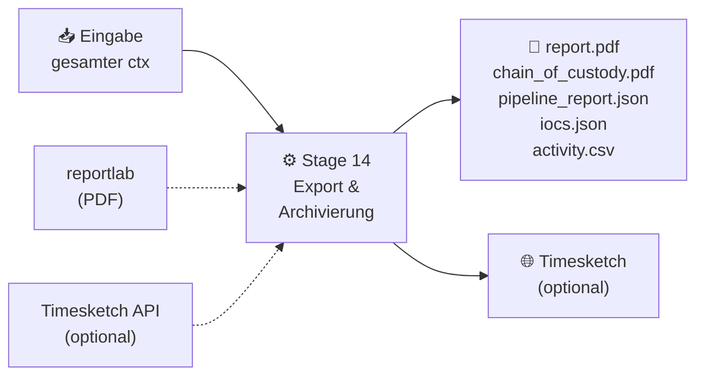

> **Abbildung 5.13:** Stage 14 — Export aller Ergebnisse *(Quelle: Autor, 2026)*

Stage 14 erstellt folgende Ausgabedateien:

**`pipeline_report.json`** enthält die maschinenlesbare Zusammenfassung der gesamten Analyse in vier Abschnitten: `meta` (Case-ID, Erstellungszeitpunkt, Pipeline-Version, Laufzeit in Minuten), `input` (Disk-Image-Pfad, SHA256, MD5, Dateigröße, Format), `system_profile` (OS-Familie, OS-Name, Kernel, Hostname, Zeitzone) und `statistics` (Anzahl Events, IOCs, Anti-Forensics-Treffer, Anomalien).

**`iocs.json`** enthält alle extrahierten IOC-Objekte als JSON-Array, gegliedert nach IOC-Typ. Jedes IOC-Objekt enthält Typ, Wert, Quellinformation, Kontext und Zeitstempel der Extraktion.

**`activity.csv`** ist eine chronologisch sortierte Liste aller Events aus `events.db` im CSV-Format — geeignet für externe Tools und manuelle Analyse.

**`report.pdf`** ist der forensische Hauptbericht, generiert mit reportlab. Die Struktur umfasst: Titelseite (Case-ID, Datum, Analyst), Executive Summary (Systemübersicht, Qualitätsurteil, Top-Befunde), Partition-Layout und System-Profiling, Nutzer-Tabelle (alle Nutzer mit UID, Shell, letztem Login, Sudo-Rechten), Basic Checks (Log-Vollständigkeit), IOC-Tabellen gegliedert nach Typ, Anti-Forensics-Befunde nach Schweregrad sortiert, Stage-Status-Übersicht und Statistiken.

**`chain_of_custody.pdf`** protokolliert die forensische Beweiskette der Analysephase: Hash-Werte des Ausgangs-Images (SHA256, MD5, Quelle), Startzeitpunkt der Analyse, Stage-Einträge mit UTC-Zeitstempel und Status sowie Hashes aller extrahierten Dateien. Das Dokument ist ausschließlich von der Pipeline signiert — es dokumentiert die digitale Analysephase, ersetzt aber nicht die manuelle Beweisdokumentation vor und nach der Analyse (Sicherstellung, Transport, Übergabe).

Optional erstellt Stage 14 zusätzlich einen **`DFIR_Critical_Report.pdf`** wenn KI-generierte Texte (via `ki_text_generator`) verfügbar sind und `CRITICAL`-Befunde vorliegen. Dieser konditionelle Bericht enthält KI-formulierte Erläuterungen zu den kritischsten Anti-Forensics-Treffern.

---

## 5.4 Forensische Integrität der Analysephase

Die Pipeline implementiert den forensischen Integritätsnachweis für die Analysephase — sie ersetzt nicht die manuelle Dokumentation der Beweiskette vor und nach der digitalen Analyse. Die vier Kernmechanismen der Integritätssicherung sind:

**Hash-Verifizierung:** Zu Beginn der Analyse berechnet Stage 01 SHA256 und MD5 des Eingangs-Images (oder liest sie aus dem E01-Container). Diese Hashwerte werden im `ChainOfCustody`-Objekt gespeichert. Eine erneute Verifikation am Ende — ob das Image unverändert blieb — ist konzeptionell vorgesehen: Da die Pipeline das Image nur lesend öffnet (keine schreibenden Zugriffe), bleiben die Hashes de facto identisch. Das `hash_source`-Feld dokumentiert transparent ob die Hashes gemessen oder übernommen wurden.

**Pipeline-Ausführungsprotokoll:** Die `ChainOfCustody`-Klasse (`models/chain_of_custody.py`) akkumuliert für jede Stage einen `CoCEntry` mit Stage-Name, UTC-Zeitstempel und Kurzstatus. Dies erzeugt ein lückenloses Protokoll: welche Analyse zu welchem Zeitpunkt durchgeführt wurde, welche Ergebnisse jede Stage lieferte und welche Stages übersprungen oder fehlgeschlagen sind.

**Hash-Protokollierung extrahierter Dateien:** Alle von Stage 05 per `icat` extrahierten Log-Dateien und wiederhergestellten Fragmente werden via `compute_both()` gehasht. Die 64-KB-Streaming-Implementierung verhindert RAM-Überlastung bei großen Dateien. Die Hashwerte werden über `coc.add_file_hash()` in das CoC-Objekt eingetragen und im finalen `chain_of_custody.pdf` aufgelistet. So ist für jede extrahierte Datei nachvollziehbar, welchen Hashwert sie zum Zeitpunkt der Extraktion hatte.

**Abgrenzung der Analysephase:** Das `chain_of_custody.pdf` dokumentiert ausschließlich die digitale Analysephase — beginnend mit der Hash-Berechnung des Images und endend mit dem Export. Die vollständige forensische Beweiskette (Sicherstellung des Trägermediums, Transport, Übergabe an das Labor, Archivierung) liegt außerhalb des Zuständigkeitsbereichs der Pipeline und muss durch manuelle Dokumentation nach etablierten Verfahrensstandards ergänzt werden.

---

## 5.5 Timesketch-Integration

Timesketch ist eine Open-Source-Plattform für forensische Timeline-Analyse. Die Pipeline integriert Timesketch als optionale Ausgabe: nach dem regulären Pipeline-Durchlauf können die Events aus `events.db` in einen Timesketch-Sketch hochgeladen und dort interaktiv analysiert werden.

Der Upload-Workflow ist entkoppelt vom Pipeline-Durchlauf: Das separate Skript `upload_timesketch.py` findet die aktuellste `events.db` und `pipeline_report.json` im Ausgabe-Verzeichnis, konvertiert die Events und lädt sie hoch.

```python
# Schematischer Ablauf upload_timesketch.py
events = event_store.get_all_sorted()
jsonl_lines = [json.dumps({
    'datetime': e.timestamp.isoformat(),
    'message':  e.message,
    'source':   e.source,
}) for e in events]
timesketch_client.upload_timeline(sketch_id, jsonl_lines)
```

### 5.5.1 Timeline-Upload (JSONL-Format)

Der Timesketch-Upload erwartet Events im JSONL-Format (JSON Lines): eine JSON-Zeile pro Event. Das Pflichtfeld ist `datetime` im ISO-8601-Format (UTC). Zusätzliche Felder wie `message`, `source`, `timestamp_desc` und benutzerdefinierte Felder werden von Timesketch als Attribute der Timeline-Einträge gespeichert und sind in der Suche filterbar.

Die Events aus `events.db` werden zunächst via `EventStore.get_all_sorted()` chronologisch sortiert abgerufen und anschließend in JSONL-Zeilen serialisiert. Der Upload erfolgt über den `timesketch-api-client` mit den Verbindungsdaten aus `config.yaml` (Host, Port, Benutzername, Sketch-ID).

In Timesketch stehen nach dem Upload alle Events als durchsuchbare Timeline zur Verfügung: Analysten können nach Zeiträumen filtern, Events nach Source gruppieren, Labels vergeben und Kommentare hinzufügen. Die Integration mit Sigma-Regeln in Timesketch erlaubt eine regelbasierte Nachanalyse der Timeline, die über die Hayabusa-Voranalyse hinausgeht.

---

## 5.6 Deployment (Docker Compose Stack)

Die Pipeline selbst läuft direkt auf dem Analyserechner ohne Containerisierung — der direkte Zugriff auf das Disk-Image und lokale externe Tools (TSK, YARA, Volatility3) wäre in einem Container ohne Volume-Mounts und Host-Bindungen erschwert. Containerisiert werden Timesketch und Elasticsearch als deren Backend:

```bash
# Starten des Docker-Stacks
docker compose up -d

# Pipeline ausführen (Analyserechner)
python pipeline.py disk.E01 \
    --ram memory.raw \
    --output_dir ./output \
    --mode auto \
    --yara custom \
    --workers 4
```

Der Docker Compose Stack besteht aus zwei Diensten: **Elasticsearch 7.17.9** (Single Node, 1 GB Heap, Port 9200, persistentes Volume `es_data`) als Datenspeicher und **Timesketch** (Port 5000, persistentes Volume `ts_data`) als Web-Oberfläche.

Die Voraussetzungen für einen vollständigen Pipeline-Durchlauf sind:

- Python 3.11 mit installierter Virtualenv und allen Abhängigkeiten aus `requirements.txt`
- The Sleuth Kit 4.15 (Binaries: `mmls`, `fsstat`, `fls`, `icat`, `tsk_recover`, `mactime`, `istat`)
- YARA und yara-python (für Stage 09)
- Volatility3 (für Stage 02, optional)
- Hayabusa (für EVTX-Analyse, optional)
- bulk_extractor (für IOC-Carving, optional)
- Docker und Docker Compose (für Timesketch, optional)

Nicht-optionale externe Tools (TSK, YARA) lösen bei Fehlen einen Stage-Fehler aus, der in `ctx.stage_errors` protokolliert wird und das Qualitätsurteil in Stage 13 beeinflusst. Optionale Tools (Volatility3, Hayabusa, bulk_extractor, Timesketch) werden übersprungen ohne den Analyse-Durchlauf zu unterbrechen.
